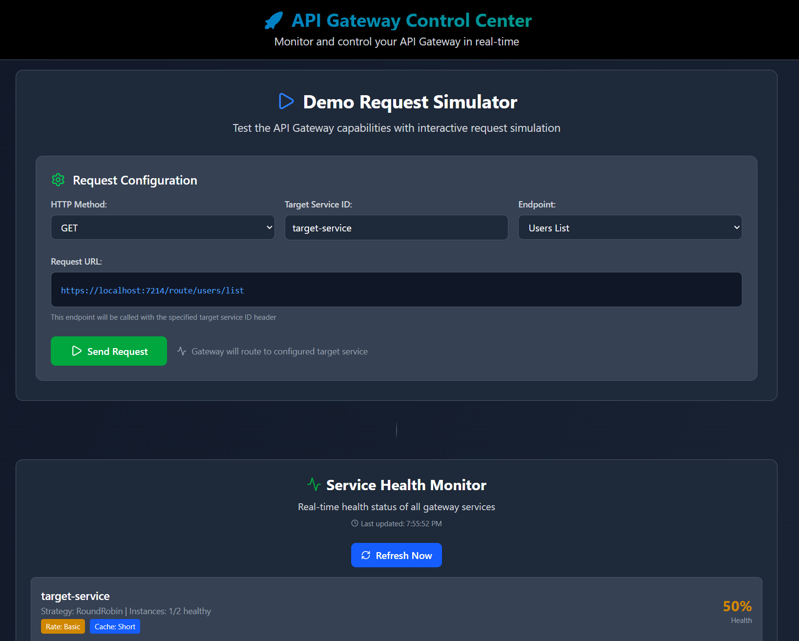
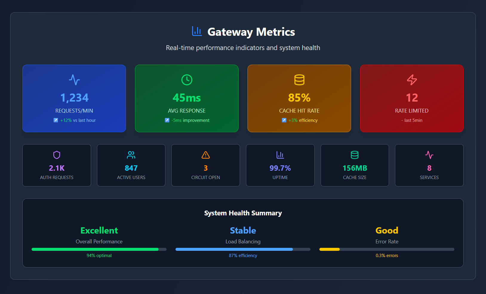
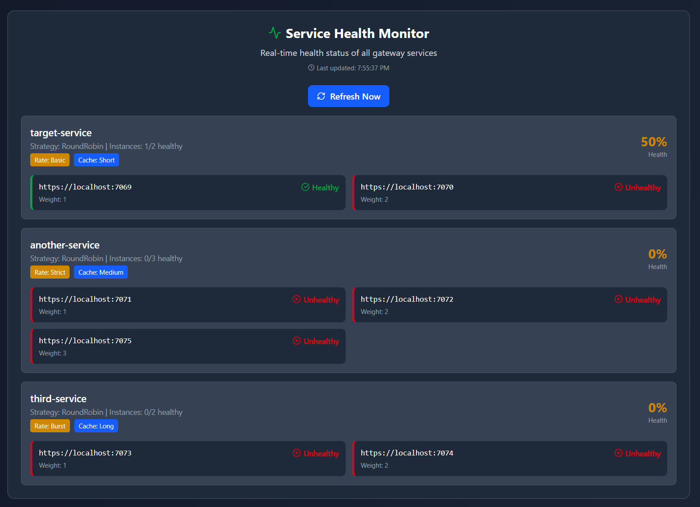
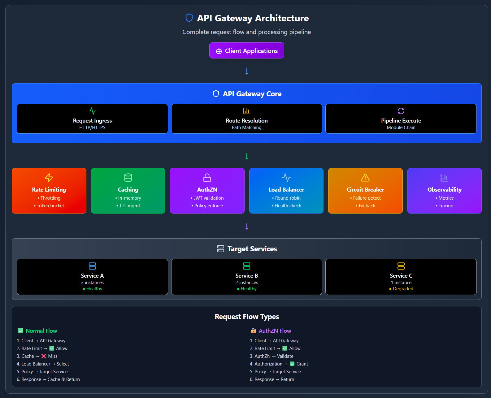

# Lightweight API Gateway

A modern, production-ready API Gateway built with ASP.NET Core 9.0, inspired by Netflix's Zuul. Features modular architecture, real-time metrics, and comprehensive telemetry powered by OpenTelemetry.

## 🎯 Key Features

- **Smart Routing** - Route requests to backend services with flexible configuration
- **Authentication** - Bearer token validation with issuer/audience verification
- **Rate Limiting** - Configurable algorithms (Sliding Window, Token Bucket, Fixed Window)
- **Load Balancing** - Round-robin, least-connections, and weighted strategies
- **Response Caching** - Memory-based caching with flexible TTL policies
- **Circuit Breaker** - Fault tolerance with automatic failure detection
- **Real-Time Metrics** - OpenTelemetry + Prometheus for observability
- **Health Checks** - Monitor backend service availability

## 🏗️ Architecture

The gateway follows a modular design where each feature is a separate project:

```
Gateway.Api           → Web layer (Minimal APIs)
Gateway.Core          → Core orchestration logic
Gateway.Auth          → JWT Bearer authentication
Gateway.RateLimiting  → Flexible rate limiting algorithms
Gateway.LoadBalancing → Multiple balancing strategies
Gateway.Caching       → Response caching layer
Gateway.Proxy         → HTTP forwarding engine
Gateway.Metrics       → OpenTelemetry integration
Gateway.Common        → Shared utilities & models
```

Each module records its own telemetry and policies are configured inline per service in `appsettings.json`.

## 🚀 Quick Start

### Prerequisites
- .NET 9.0 SDK
- Node.js 18+ (for demo frontend)

### Run the Gateway

```bash
cd src/Gateway.Api
dotnet run
```

Gateway starts on `https://localhost:7214`

### Run the Demo Frontend

```bash
cd demo/GatewayDemoWebPage
npm install
npm run dev
```

Frontend starts on `http://localhost:5173`

### Run a Target Service

```bash
cd demo/TargetService.Api
dotnet run
```

## 📸 Live Demo Dashboard

The project includes a React-based demo dashboard showcasing real-time gateway capabilities:

### Request Simulator
Test different endpoints and see how the gateway handles them:



### Gateway Metrics
Real-time metrics powered by OpenTelemetry - track requests, latency, cache efficiency, and error rates:



### Service Health Monitor
Monitor all backend services and their health status with auto-refresh:



### Architecture Visualization
Visual representation of request flow through the gateway pipeline:



## ⚙️ Configuration

Configure services and policies inline in `appsettings.json`:

```json
{
  "Gateway": {
    "TargetServices": [
      {
        "ServiceId": "user-api",
        "LoadBalancingStrategy": "RoundRobin",
        "Instances": [
          { "Address": "http://localhost:5001", "Weight": 1 }
        ],
        "RateLimitPolicy": {
          "RequestsPerWindow": 100,
          "WindowSize": "00:01:00",
          "Algorithm": "SlidingWindow"
        },
        "CachePolicy": {
          "Duration": "00:05:00",
          "Methods": ["GET"],
          "VaryByQuery": true
        },
        "AuthPolicy": {
          "ValidIssuers": ["https://your-issuer.com"],
          "ValidAudiences": ["your-api"]
        }
      }
    ]
  }
}
```

**Flexible Policy Configuration:**
- Policies are defined inline per service (no shared policy dictionaries)
- Each service can have unique rate limiting, caching, and auth policies
- Set policies to `null` to disable features per service

## 🔐 Authentication

The gateway supports JWT Bearer token authentication:

```bash
# Request to protected service
curl -H "Authorization: Bearer <jwt-token>" \
     -H "X-Gateway-TargetServiceId: protected-api" \
     http://localhost:5000/api/resource
```

**Features:**
- Per-service JWT validation policies
- Issuer and audience validation
- Automatic token validation via Microsoft.IdentityModel
- Authenticated user context available to downstream services
- Full metrics for authentication attempts and failures

See `docs/GATEWAY_AUTH.md` for detailed configuration.

## 📊 Observability

- **Prometheus Metrics** - Available at `/metrics` endpoint
- **Health Checks** - Available at `/health-status` endpoint
- **Structured Logging** - All modules use `ILogger<T>` for consistent logging

### Key Metrics

- `gateway_requests_total` - Total request count by service/status
- `gateway_request_duration` - Request latency histogram
- `gateway_auth_requests_total` - Authentication attempts by result
- `gateway_auth_errors_total` - Authentication failures
- `gateway_cache_hits_total` / `gateway_cache_misses_total` - Cache performance
- `gateway_backend_errors_total` - Backend failure tracking
- `gateway_rate_limit_requests_total` - Rate limiting statistics

## 🛠️ Technical Stack

**Backend:**
- ASP.NET Core 9.0 with Minimal APIs
- OpenTelemetry for metrics & tracing
- Prometheus exporter
- Microsoft.IdentityModel for JWT validation
- Memory-based caching

**Frontend:**
- Vite + React 18 + TypeScript
- TailwindCSS v4 for styling
- Axios for API calls
- Lucide React for icons

## 💡 Design Decisions

- **Modular Architecture** - Each feature is isolated for maintainability and testability
- **OpenTelemetry First** - Built-in observability without vendor lock-in
- **Inline Policy Configuration** - Policies defined per service for maximum flexibility
- **Primary Constructors** - Modern C# 12 features throughout
- **Result Pattern** - Explicit error handling without exceptions for flow control
- **Singleton Services** - Most services are stateless singletons for performance
- **Internal Encapsulation** - Module implementations are internal, only extensions are public

## 🔄 Request Flow

```
Client → Gateway.Api → CoreMetrics → Telemetry → RateLimiting → Auth → Caching → LoadBalancer → Proxy → Backend
```

Each middleware can short-circuit the pipeline (e.g., return 401 for auth failure, return cached response, reject rate-limited request).

## 📝 License

MIT

---

Built with ❤️ to demonstrate modern .NET architecture patterns and microservices best practices.
